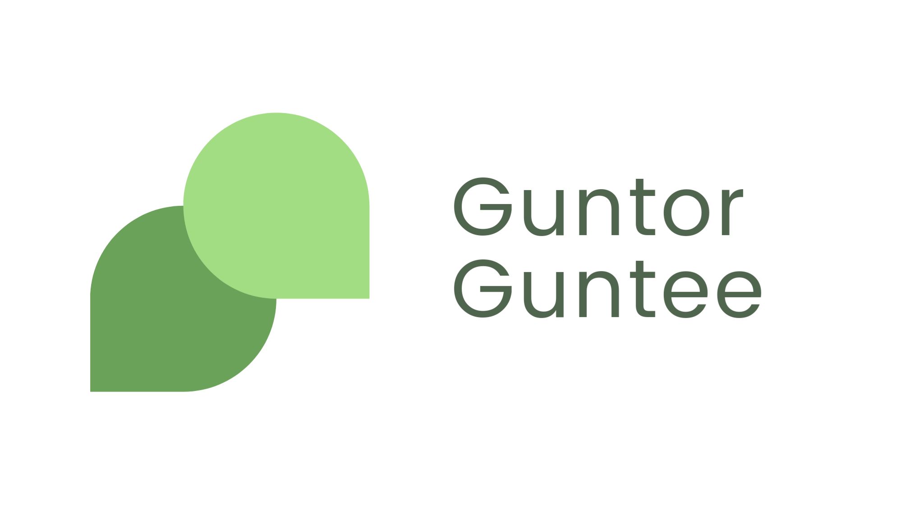
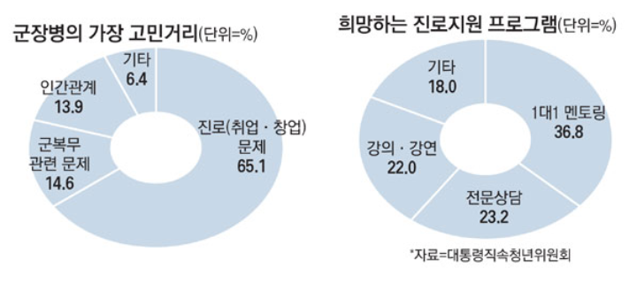

# 🪖 군토&군티 (Guntor & Guntee)

> *누구에게나 의미있고 값져야 할 군생활이니까*
> 

<br>

### 📍 목차

<details>

<summary>(펼치기)</summary>

- [🫂 프로잭트 소개](#🫂-프로잭트-소개)  

    - [🗺 Overview](###🗺-Overview)  

    - [🤔 문제 인식](##🤔-문제-인식)  

    - [💡 해결 방안](##💡-해결-방안)  

    - [💭 상황 설정](##💭-상황-설정)  

    - [👤 예상 사용자](##👤-예상-사용자)  

- [⚙️ 기능 설명](#⚙️-기능-설명)  

    - 

- [✨ 기대 효과](#✨-기대-효과)

    - [🍀 의미있고 값진 군생활](##🍀-의미있고-값진-군생활)

    - [🔭 발전 가능성](##🔭-발전-가능성)

    - [⌨ 공개 SW 발전 방향](##⌨-공개-SW-발전-방향)

- [🖥️ 컴퓨터 구성 / 필수 조건 안내 (Prerequisites)](#🖥️-컴퓨터-구성-/-필수-조건-안내-(Prerequisites))

- [🔧 기술 스택 (Techniques Used)](#🔧-기술-스택-(Techniques-Used))

- [📀 설치 안내 (Installation Process)](#📀-설치-안내-(Installation-Process))

- [📋 프로젝트 사용법 (Getting Started)](#📋-프로젝트-사용법-(Getting-Started))

- [👥 팀 정보 (Team Information)](#👥-팀-정보-(Team-Information))

- [# ©️ 저작권 및 사용권 정보 (Copyleft / End User License)](#©️-저작권-및-사용권-정보-(Copyleft-/-End-User-License))

</details>

<br>

# 🫂 프로잭트 소개

### 🗺 Overview

'군토&군티'는 멘토링에 필요한 모든 것을 제공합니다.

군토&군티를 이용해 멘토링 제작, 신청, 진행, 관리까지 가능합니다.

군토&군티에서 멘토는 자신의 지식과 노하우를 공유할 수 있습니다. 또 멘티는 멘토링을 통해 자기계발에 도움을 받을 수 있습니다.

현재 군에 복무 중인 장병은 모두 각각의 다양한 경력을 가지고 있습니다. 동시에 더 나은 자신이 되고자 자기계발에 목말라합니다.

국군 장병의 경력을 최대한 활용하면서 그들의 성장을 도울 방법으로 멘토링을 선택하였습니다.

자발적이고 적극적인 멘토링을 중심으로 성장형 커뮤니티를 형성하는 것이 '군토&군티'의 목적입니다.

<br>

## 🤔 문제 인식

<details>

<summary>(펼치기)</summary>

### 진로, 학업에 대한 고민

<br>



<br>

> 대통령직속 청년위원회(청년위)와 국방부가 군 장병 2020명을 대상으로 실시한 공동 실태 조사에 따르면 청년 장병의 가장 큰 고민은 **'진로(취업·창업) 관련 문제'(65.%)**로 '군 복무 고민'(14.6%)보다 그 수치가 월등히 높았다. 특히 **응답자 중 절반(48.8%)** 가까이가 **군 생활로 인한 경력 단절의 부담**을 느끼고 있었고, **제대 후 사회 적응이 부담**된다고 밝힌 인원도 **50.4%**다. 또 계급이 높아질수록, 고학력자일수록 진로를 고민하는 비율이 상승했다. **군 복무 중에도 취업과 미래를 위해 노력해야 한다**고 응답한 비율이 **69.4%**에 달했다. **군 장병 10명 중 7명**이 극심한 취업난에 **자기계발의 강박**에서 자유롭지 못했다. **군 장병 2명 중 1명**은 **제대 후 삶에 대한 부담과 불안감**에 휩싸여 있었다.  
[출처] [전역예정자 65% "진로 큰 고민…치킨집이라도 해야하나"](https://mirakle.mk.co.kr/view.php?year=2017&no=189906)
> 

청년 장병들의 가장 큰 고민은 진로입니다. 청년 장병들은 20여 년간 쌓아온 것들을 뒤로한 채 군인으로서의 책임을 다합니다. 군 복무 기간 동안 학업과 경력이 단절됩니다. 청년 장병들은 전역 후의 삶에 대해 부담과 불안감을 느끼고 있습니다. 무엇을 공부해야 할지 고민하는 장병뿐만 아니라 미래와 진로에 대한 근본적인 고민을 하는 장병도 많습니다. 통계 자료에 의하면 청년 장병들의 36.8%가 멘토링을, 23.2%가 전문상담을 희망합니다. 50% 이상의 장병이 일회성의 강의-강연이 아닌, 장기간에 걸친 체계적 프로그램을 필요로 하고 있습니다.

</details>

<br>
    

## 💡 해결 방안

<details>

<summary>(펼치기)</summary>
    
### 경력과 역량 개발에 효과적인 멘토링

경력 개발과 역량 개발에서 멘토링의 우수성은 수년간의 연구를 통해 증명되었습니다. 대기업들 또한 신입사원들의 역량 개발을 위한 프로그램으로 멘토링을 시행하고 있습니다. 50% 이상의 장병이 멘토링과 같은 체계적인 프로그램을 필요로 하고 있습니다. 고민에 대한 답을 찾을 의지와 능력이 있는 청년 장병에게 고민을 덜어줄 수 있는 가장 효과적인 방법은 멘토링입니다.

</details>

<br>

## 💭 상황 설정

<details>

<summary>(펼치기)</summary>
    
### 입대를 앞둔 사람의 고민과 결정 - 죽느냐 사느냐, 그것이 문제로다

여기 입대를 앞둔 굳건이가 있습니다. 굳건이는 막연한 군생활이 걱정됩니다. 너무 답답한 나머지 굳건이는 군대를 갔다온 주변 선배들에게 조언을 구해봅니다.

'선배 A'는 군생활이 크게 성장할 수 있었던 인생의 터닝 포인트였다고 말합니다. 몸도 좋아졌고, 돈도 모았고, 책도 읽고, 원하는 공부도 할 수 있었다고 합니다. 군대에서 삶에 대한 진지한 고민을 할 수 있었고 구체적인 목표와 계획을 세울 수 있었다고 합니다. 선배 A는 굳건이에게 너무 걱정하지 말라고 말하며 의미있고 값진 시간으로 만들어나가길 바란다고 충고해줍니다.

'선배 B'는 군생활에 대한 다른 이야기를 말해줍니다. 군생활은 시간 낭비라고, 군대에 가서 바보가 되서 나왔다고 말합니다. 군생활이 너무 끔찍했으며 몸만 건강히 전역해도 충분하다고 말합니다. 군생활 열심히 하는 것 만큼 쓸모 없는 것이 없다고 말합니다. 선배 B는 군 복무 기간 동안 그냥 죽었다고 생각하라고 충고합니다.

두 선배의 의견 모두 일리가 있습니다. 하지만 굳건이는 인생의 가장 중요한 시기를 군대에 있다고 낭비하고 싶지는 않습니다. 슬기롭게 군생활을 해쳐나간 선배 A가 존경스럽습니다. 굳건이도 선배 A를 본받아 자기계발을 열심히 하기로 마음을 먹습니다.

### 머지 않아 찾아온 불편한 손님, 슬럼프 - 어디로 가야하오...

큰 꿈을 안고 입대한 굳건이는 머지 않아 어려움을 겪습니다. 하고 싶은 것은 많지만 어떻게 해야할지 하나도 모르겠습니다. 운동을 하고 싶지만 팔굽혀펴기 10개 하기도 너무 힘듭니다. 맛있는 냉동 음식과 과자를 매 끼니 챙겨 먹느라 돈도 잘 모이지 않습니다. 책을 읽어도 졸리기만 합니다. 어떤 공부를 해야할지 감이 오지 않습니다. 당장 내일을 어떻게 살아야 할지도 모르겠습니다. 삶의 목표가 더욱 흐릿해지기만 했습니다.

이렇게 살면 안 된다고 자신을 다그치고 또 다그치지만 변하지 않는 자신이 야속합니다. 굳건이는 속으로 멘토 같은 사람이 방향을 설정해주고 이끌어줬으면 좋겠다고 생각합니다. 열심히 하고 싶은 마음은 정말 가득하지만 실천할 의지와 정보가 부족함을 느낍니다. 굳건이를 도와줄 사람은 존재하지 않는 것일까요?

### 뭐가 문제야 Say Something - '군토&군티'가 있잖아!

슬럼프에 빠진 굳건이는 '군토&군티'라는 서비스를 접하게 됩니다. 군토&군티에 등록된 유능한 멘토들의 다양한 멘토링 프로그램 중 굳건이가 필요한 멘토링이 찾아봅니다. 굳건이는 평소 관심을 갖고 있던 운동, 공부 관련 멘토링의 소개 글을 상세히 살펴봅니다. 멘토의 포트폴리오까지 꼼꼼히 참고해 찾은 멘토링을 신청합니다. 유능한 멘토를 만나 자신이 원하던 자기 계발을 효과적으로 진행합니다. 채팅 기능을 이용해 과제도 주고 받으며 멘토링을 체계적으로 진행합니다. 이렇게 자기계발에 성공한 굳건이는 이번에 멘토로서 활동해 자신의 지식과 노하우를 또 전달해줍니다. 군토&군티를 통해 굳건이는 자신이 계획하던 꿈을 이루고 전역하게 됩니다. 멘토링을 통해 배우고 느낀 점들은 소중한 경험이 되었습니다.

이 이야기는 비단 굳건이만의 이야기가 아닙니다. 군토&군티를 사용하는 모든 장병의 이야기가 될 수 있습니다. 군토&군티는 장병들의 적극적인 참여로 더욱 더 큰 커뮤니티로 성장할 수 있습니다. 서로 배우고 가르치며 모든 장병들이 자신의 꿈을 이룰 수 있는 성장형 커뮤니티가 될 것 입니다.

</details>

<br>

## 👤 예상 사용자

<details>

<summary>(펼치기)</summary>
    
### 자신의 지식과 노하우를 함께 공유하고자 하는 멘토

- 유능한 멘토는 멘토링 소개와 포트폴리오 작성만으로 쉽고 간편하게 멘토링을 시작할 수 있습니다.
- 서비스에서 제공하는 채팅, 과제 등의 매니지먼트 시스템을 이용해 지식 전달에만 집중할 수 있습니다

### 배우고자 하는 열정이 넘치지만 도움이 필요한 멘티

- 필요한 멘토링을 추천을 통해 발견할 수도, 태그를 이용해 직접 찾아볼 수도 있습니다.
- 멘토링에 첨부돼있는 소개글과 포트폴리오를 참고해 정말 나에게 필요한 멘토링을 선택할 수 있습니다.

</details>

<br>

> 모든 장병이 가슴에 품은 목표를 이룰 수 있는 그날까지 전국의 인재들을 이어주는 **'군토&군티'**가 되겠습니다.
> 

# ⚙️ 기능 설명

### 📌 골라 들을 수 있는 멘토링

- 내용

### 📂 손 쉬운 포트폴리오 관리

- 내용

### 🔴 실시간으로 이루어지는 멘토링

- 내용

### 📈 실력만큼 같이 쌓이는 경험치

<br>

# ✨ 기대 효과

## 🍀 의미있고 값진 군생활

### 자발적인 멘토링을 통한 체계적인 자기계발

- 손쉬운 포트폴리오, 멘토링 제작으로 **누구나 시작할 수 있는 멘토링**
- 포트폴리오로 멘토의 경력까지 확인할 수 있는 **내게 정말 필요한 멘토링**
- 태그로 간편하게 찾아볼 수 있는 **다양한 분야의 멘토링**
- **유능한 멘토와 열정적인 멘티**가 만나 **이루어지는 효과적인 멘토링**

### 언택트의 거리에서 온택트의 마음으로 함께하는 성장 커뮤니티

- **언택트의 거리에서 온택트의 마음으로 진행**하는 멘토링에서 싹트는 **멘토와 멘티 간 유대감**
- **커뮤니티**에서 이루어지는 비슷한 관심사를 가진 **사람들과의 생산적인 소통**
- 부대 안에서만 국한되던 **인맥의 확장, 단절감 극복**

<br>

## 🔭 발전 가능성

### 신병 및 초급 간부의 조기 조직사회화 프로그램

부대 내 분대장, 주임원사, 대대장 등 **선임 병사, 간부**가 **'군토&군티'의 체계적인 멘토링 서비스를 이용**하여 **신병 및 초급 간부의 부대 적응**을 도울 수 있습니다.

### 전문 상담가와의 정기적이고 체계적인 상담 프로그램

멘토링 사이에 **병영상담가의 상담 프로그램**을 배치하여 '군토&군티' 이용자가 가지고 있는 **병영생활 고충의 해결**을 도울 수 있습니다.

<br>

## ⌨ 공개 SW 발전 방향

### 공개된 API와 체계적으로 정리된 관련 문서

공개된 API와 체계적으로 정리된 관련 문서로 군토&군티는 iOS 앱, 안드로이드 앱 등 다양한 플랫폼으로 확장 가능합니다. 현재 군토&군티는 웹 앱으로 개발되었습니다. iOS 앱, 안드로이드 앱으로의 확장은 국군 장병들의 사용에 대한 편리성과 접근성을 높일 것입니다. 높은 접근성은 국군 장병의 더욱 적극적인 참여를 장려할 수 있습니다. 또 음성 채팅과 같이 스마트폰 앱의 특징을 활용하여 멘토링을 더욱 효과적으로 실시할 수 있을 것입니다.

### 기능별 MSA를 통해 가능한 확장 유연성

저희는 MSA 개념을 적극적으로 도입해 개발하였습니다. 채팅 기능이 대표적인 예입니다. 서버는 django(python)를 이용했고 채팅 기능은 socket.io(javascript)를 이용하였습니다. MSA와 자세한 문서를 작성해 유연한 확장성을 갖추었습니다. socket.io를 이용해 음성 채팅으로 기능을 추가할 수 있습니다. 이외에도 추가 확장을 위한 프레임워크를 큰 충돌 없이 도입 가능합니다.

### 국군 장병의 가려운 부분을 알려주는 데이터

멘토링 목록, 멘토링 태그, 커뮤니티 게시글 등을 빅데이터로 이용할 수 있습니다. 군토&군티에서 생성되는 데이터들은 국군 장병의 주요 관심사와 병영생활 고충을 담고 있습니다. 이 데이터는 병영문화 혁신으로 이어지는 발전 방향을 제시할 수 있습니다.

<br>

# 🖥️ 컴퓨터 구성 / 필수 조건 안내 (Prerequisites)

- ECMAScript 6 지원 브라우저 사용
- 권장: Google Chrome 버젼 77 이상
- Python 3.9 이상

<br>

# 🔧 기술 스택 (Techniques Used)

## BackEnd

**Server**

- django
- django-rest-framework

**Chatting**

- socket.io

**Hosting**

- gunicorn
- heroku

<br>

## FrontEnd

**Web Dev**

- React.js
- Babel
- HTML/CSS/JS
- AXIOS

**Design**

- sass
- reactstrap

<br>

## DevOps

**Dev Strategy**

- Git, Git-flow

**Documentation**

- Notion

**Communication**

- Jandi

**Web Design**

- Figma

**Database Design**

- ERD Cloud

<br>

# 📀 설치 안내 (Installation Process)

```jsx
$ git clone git주소

$ yarn or npm install

$ yarn start or npm run start
```

<br>

# 📋 프로젝트 사용법 (Getting Started)

<br>

# 👥 팀 정보 (Team Information)

|  이름  |        역할       |                           GitHub IDs                          |         E-Mails         |
|:------:|:-----------------:|:-------------------------------------------------------------:|:-----------------------:|
| 이지호 | 조장 / 프론트엔드 |           [mangming2](https://github.com/mangming2)           |   leejiho35@gmail.com   |
| 박지인 |       백엔드      |            [nagi0101](https://github.com/nagi0101)            |   demon0315@naver.com   |
| 양현동 |       백엔드      |       [Yanghyeondong](https://github.com/Yanghyeondong)       |   hdyang0686@naver.com  |
| 이재용 |     프론트엔드    | [VirtualExplorer7613](https://github.com/VirtualExplorer7613) |  roqkfwk7613@gmail.com  |
| 이채준 |       백엔드      |          [chaejunlee](https://github.com/chaejunlee)          |   chainjaxx@naver.com   |
| 이현희 |     프론트엔드    |          [nonaninona](https://github.com/nonaninona)          | starcraft0529@gmail.com |

<br>

# ©️ 저작권 및 사용권 정보 (Copyleft / End User License)

* [MIT](https://github.com/osam2020-WEB/Sample-ProjectName-TeamName/blob/master/license.md)

This project is licensed under the terms of the MIT license.

※ [라이선스 비교표(클릭)](https://olis.or.kr/license/compareGuide.do)

※ [Github 내 라이선스 키워드(클릭)](https://docs.github.com/en/github/creating-cloning-and-archiving-repositories/creating-a-repository-on-github/licensing-a-repository)

※ [\[참조\] Github license의 종류와 나에게 맞는 라이선스 선택하기(클릭)](https://flyingsquirrel.medium.com/github-license%EC%9D%98-%EC%A2%85%EB%A5%98%EC%99%80-%EB%82%98%EC%97%90%EA%B2%8C-%EB%A7%9E%EB%8A%94-%EB%9D%BC%EC%9D%B4%EC%84%A0%EC%8A%A4-%EC%84%A0%ED%83%9D%ED%95%98%EA%B8%B0-ae29925e8ff4)